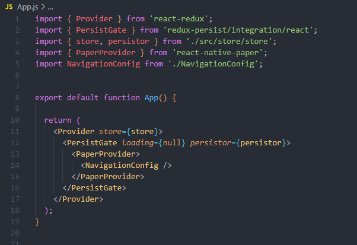
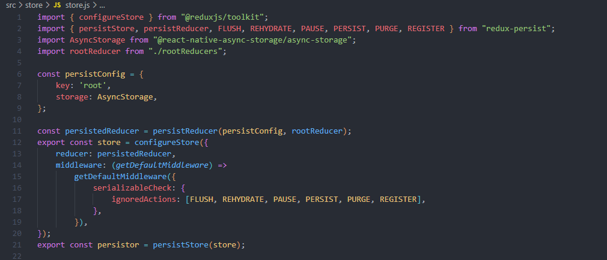

Este proyecto es desarrollado como prueba técnica para Meda. Los requerimientos se mantienen en comunicación interna y solo el personal con los conocimientos pertinentes a lo que corresponde la aplicación.  
Con base a los requerimientos que se mencionan en el PDF para empezar la aplicación se pretende hacer uso de distintas librerías tales que ayudaran al funcionamiento y a cumplir uno de los requerimientos necesarios solicitados.

Es por ello que se incluyen las librerías siguientes:

- "@react-native-async-storage/async-storage"
- "@react-navigation/native"
- "@react-navigation/native-stack"
- "@reduxjs/toolkit"
- "expo"
- "expo-status-bar"
- "react"
- "react-native"
- "react-native-paper"
- "react-native-safe-area-context"
- "react-native-screens"
- "react-native-vector-icons"
- "react-redux"
- "redux-persist"
- "expo-sqlite"
- "expo-file-system"
- "expo-asset"

## Complementos

### Aplicación

Se selecciona como base y punto de partida [Expo](https://expo.dev/) esto ya que facilita el inicio de una aplicación móvil y no traer modulos que podrian no ser necesarios.

### Interfaz

Para llevar a cabo el diseño de los componentes se selección el framework [reactnativepaper](https://reactnativepaper.com/) ya que es algo utilizado por gran parte de la comunidad y algunas empresas para sus aplicaciones en producción.

### Storage

Para el almacenamiento interno en dispositivos se usa [expo-sqlite](https://docs.expo.dev/versions/latest/sdk/sqlite/) esto debido a que da la facilidad de manejar la base de datos acorde a nuestras necesidades y manteniendo la persistencia de datos. Por otro lado también se implemente [Redux](https://redux.js.org/introduction/getting-started), [Redux Persist](https://github.com/rt2zz/redux-persist) y [Async Storage](https://github.com/react-native-async-storage/async-storage#readme), aunque estos su uso real es lo para mantener específicamente alguna información de credenciales para un login EM.

### Route

Para llevar a cabo el Route de nuestra aplicación se escoge el framework de [React Navigation](https://reactnavigation.org/), aunque la versión que brinda Expo Route V2 podría dar mejores beneficios y podría resultar sencilla de aplicar, se pretende por rapidez en previos conocimientos mantener el uso de este framework para llevar a cabo este proyecto.

## Desarrollo

Actualmente el proyecto termina con las siguientes carpetas  

Antes de abordar algunas partes del código al ser solicitado el como se llevo acabo este proyecto se dará mención también de la parte teórica.   
Habitualmente antes de empezar un proyecto nuevo previo a comenzar a poner código investigo sobre los frameworks y características que pueden ayudar para tener un trabajo fluido, es por ello que investigo en diferentes sitios web o documentos que brinden información ya se como las ventajas o desventajas que tienen el usar dichas herramientas.

Al finalizar la investigación empiezo a fragmentar la tarea general en pequeñas sub tareas para poder tener un orden el desarrollo.

Una vez queda estructurado comienzo a escribir el código, algunas veces durante el desarrollo accedo a la documentación de los frameworks para usar ya sea sus mejores componentes o sus mejores cualidades para llevar a cabo el desarrollo, un ejemplo rapido podría ser el consultar las propiedades modificables que tienen un componente.

Una vez que termino el esquelo en diseño de lo que seria la aplicación comienzo con la lógica de funcionamiento y conforme depuro la aplicación el código compruebo su funcionalidad.  

Lo anterior mencionado se vuelve repetitivo conforme empiezo con un nuevo fragmento del código.

## Código

#### AppJS

Para empezar damos inicio con la configuración de nuestra App.js(Se ubica en la raíz de nuestra aplicación) la cual solo tendremos que importar y acomodar las funciones que deberán encapsular para brindar sus propiedades y funcionalidades.   
 

En el código anterior se importan las librerias que darán las funcionalidades de forma global a nuestra aplicación la cual no tiene un main, pero lo veremos a continuación el porque este no contiene un main.

#### NavigationConfig.js  

Previo a comenzar con las pantallas, botones, etc. Tenemos que crear nuestro componente principal el cual es nuestra navegación dentro de la aplicación

Como se ve en la imagen solo se implementan 5 rutas que tendra disponible nuestra aplicación, aunque tambien es importante menciona que 1 de ellas no contiene alguna funcionalidad.  
También se resalta en la parte superior la importación de funcionalidades de los frameworks, así como las pantallas que se mostraran por ruta. 

#### Store

Cuando hablamos del store me refiero exactamente a una carpeta que como su nombre dice almacena el store de la aplicación para el redux, redux persist y el async storage el cual lleva una configuración básica.

Empezamos con nuestro folder de loginSlice el cual crearemos nuestras acciones y funcionalidades de nuestros estados globales que por el momento solo ocuparemos 1 slice para la gestión de el usuario y contraseña de un login.   

Después creamos nuestro rootReducer para aplicar nuestro combineReducers y juntar todos los reducers para dar la configuración al store de Redux y Redux persist 

Ahora viene la configuración de nuestro store y nuestro persist

En esto hay información extra que deberá prestar atención ya que si no tuviéramos que usar un Redux Persist para guardar la información especifica, esas configuraciones extras no se tomarían en cuenta para llevar a cabo el desarrollo, también es importante saber que Async Storage no es el único camino que podríamos tomar, incluso podríamos usar la base de datos interna que hemos creado, aunque en algunos casos la configuración puede ser más complicada y como el caso de esta aplicación no es tan grande no se tomaron muchos puntos extras para tomar este camino. 

Continuando con lo mencionado sobre la funcionalidad de la líneas que deberán estar en nuestra configuración para dar el funcionamiento correcto es la siguiente:  
`serializableCheck: { ignoredActions: [FLUSH, REHYDRATE, PAUSE, PERSIST, PURGE, REGISTER], },`

Esto ya que si no ignoramos las acciones que se generan por redux o un dispatch podrían afectar al funcionamiento de redux persiste haciendo que ya no sea persistente y tendríamos perdida de datos en algún punto de la aplicación y al suceder algún tipo de evento.

#### Screens

Ahora podemos abordar la configuración de las screen donde se hablara de forma general, aunque haremos comentarios en momentos puntuales donde se preste el mencionar un comentario o nota.

****HomeScreen**** 

Como podemos ver aquí solamente se da la creación de nuestros botones que se mostraran en el inicio de nuestra aplicación. Aunque aquí solamente parece la creación y diseño de estos hay algo que debemos prestar atención para el funcionamiento de nuestras rutas. Incluso responderé a algo de porque estoy tan seguro de que esta será siempre nuestra primer pantalla a ver.  

Empecemos con la siguiente linea del código `function HomeScreen({ navigation })` la cual tiene un objeto que recibe que es navigation y este mismo nos ayudara a dar diferentes funcionalidades para movernos entre pantallas, como se ve en los botones cada uno tiene apuntada una dirección que le corresponde `onPress={() => navigation.navigate('LoginEmpleados')}` y esto sucede con el evento click.

Mientras que para saber porque siempre será esta nuestra pagina principal porque lo configuración en nuestro ***NavigationConfig.js*** con la siguiente línea de código `initialRouteName='HomeScreen'`.   

****LoginEmpresa****

Aquí también es la creación de 1 botón y dos espacios para recibir datos, pero de lo mas importante a destacar es lo que sucede en la arrow function onSubmit donde mandamos traer de nuestros hooks personalizados la arrow function de login, la cual tendrá nuestra comprobación SECRETA que solo las personas involucradas tienen acceso a esta parte, aunque si el repositorio queda publico podrás verlo. Adicionalmente podemos ver que dicha arrow function retorna un valor el cual hace referencia así hemos ingresado las credenciales correctas o no. Falta agregar validaciones con nuestro help text.        

****ListaEmpleados**** 

Esta es una de las pantallas mas completas ya que incluye la creación de nuestra BD interna, nuestros querys a la misma para guardar información y las ventanas adicionales y renderizado de componentes individuales para cada uno de ellos. 

De las lineas que mas importantes son de esta seccion son:

Donde inicia la conexion a nuestra base de datos.  
`const db = SQLite.openDatabase("empleados.db");`

El control de un modal para poder ver la información de nuestro empleado seleccionado.  
`const showModalProfile = (profile) => { setProfile(profile); setModalProfile(true); };`

El primer evento de primera carga para obtener datos en caso de que existan y crear la tabla en caso de que no exista.   
`React.useEffect(() => {`  
`db.transaction((tx) => {`  
`tx.executeSql('CREATE TABLE IF NOT EXISTS empleados (id INTEGER PRIMARY KEY AUTOINCREMENT, name TEXT, user TEXT, pass Text);');`  
`});`

`// setDataDB(resultSet.rows._array))`  
`db.transaction((tx) => {`  
`tx.executeSql('SELECT * FROM empleados', null,`  
`(txObj, resultSet) => setDataDB(resultSet.rows._array)),`  
`(txObj, error) => console.log("Error\n", error)`  
`});`  
`setLoad(false);`

`}, []);`  
  

La inserción de nuevos empleados  
`const addData = () => { db.transaction(tx => { tx.executeSql('INSERT INTO empleados (name, user, pass) values (?,?,?)', [name, user, pass], (txObj, resultSet) => { let existingNames = [...dataDB]; existingNames.push({ id: resultSet.insertId, name: name, user: user, pass: pass }); setDataDB(existingNames); setUser(''); }, (txObj, error) => console.log("Sucedio el siguiente error\n", error), ) }); hideModal(); setName('') setUser('') setPass('') }`

El renderizado de cada empleado que se encuentre en la base de datos.  
`const showDataDB = () => { return dataDB.map((item, index) => { return ( <Card style={styles.cardStyle} key={index}> <Card.Content> <Text variant="headlineSmall">Nombre</Text> <Text variant="titleLarge">{item.name}</Text> </Card.Content> <Card.Actions> <Button onPress={() => showModalProfile(item)} icon="eye-check">Ver</Button> {/* <Button>Ok</Button> */} </Card.Actions> </Card> ) }) }`

****Posts****

Ahora nos vamos al screen donde se muestran los posts donde se aplican alguna de las técnicas anteriores para renderizar componentes, pero en este caso se agrega una consulta a una api, pero como este proyecto no requiere ser tan complejo como utilizar algo distinto como crear una api interna para consultar como middleware, axios o una api creada en nodejs se utiliza la consulta de ***fetch***.

Donde es importante resaltar que para que esta no afecte o haga un bucle infinito es recomendable apoyarnos de useEffect(). 

También agregamos una animación de carga en lo que nuestro fetch realiza la consulta de datos adicionalmente renderizamos nuestros posts y manejamos nuestro scroll view ya que se reciben mas de 50+ datos distintos y estos no se verían si no hiciéramos uso de nuestro ScrollView.   

## Arrancar Aplicación

Para empezar a usar nuestra aplicación en nuestra computadora previo debemos contar con algunos requisitos básicos como:  
SDK de Android  
NodeJS (18.18.0)  
NPM 

Si contamos con ello podemos empezar a descargar el repositorio en nuestra computadora una vez lo tengamos instalado procedemos con el siguiente código  
`npm install` 

Al finalizar para ejecutar la aplicación desde la terminal usaremos  
`npx expo start`

Para hacer la build de nuestra aplicación en terminal ingresamos  
`eas build:configure`

Cuando tengamos nuestros archivo, ingresamos la siguiente linea para comenzar la build  
`eas build -p android --profile preview`